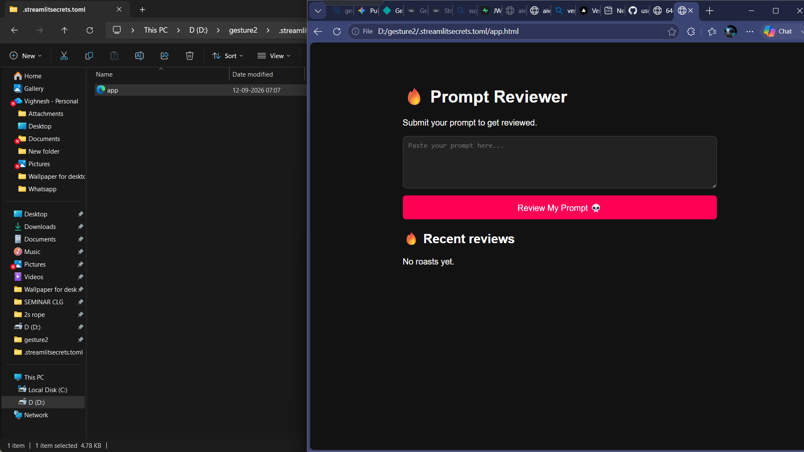

# [promt roast] 🎯

## Basic Details
### Team name: [Alan tony]

### Team Members
- Team Lead: [Alan tony] - [Baselious Mathews II Collage of engineering]

### Project Description
[roast your you based on your promts]

### The Problem (that doesn't exist)
[roasting you]

### The Solution (that nobody asked for)
[by writing the code]

## Technical Details
### Technologies/Components Used
For Software:
- [HTML]

### Implementation
For Software:
# Installation
[commands]

# Run
[commands]

### Project Documentation
For Software:Project Documentation: PromptReviewer 🔥
PromptReviewer is a lightweight, full-stack web application designed to evaluate user-submitted AI prompts, deliver humorous roasts alongside categorical verdicts, and store the history persistently using

# Screenshots (Add at least 3)

# Diagrams
![Workflow]
┌──────────────────────────────────────────┐
                  │               USER INTERFACE             │
                  │   User enters prompt in <textarea>       │
                  │   and clicks "Review My Prompt 💀"       │
                  └────────────────────┬─────────────────────┘
                                       │
                                       ▼
                  ┌──────────────────────────────────────────┐
                  │              INPUT VALIDATION            │
                  │         Is prompt empty or whitespace?   │
                  └──────────┬────────────────────┬──────────┘
                             │                    │
                    [Yes]    │                    │ [No]
                             ▼                    ▼
                    ┌─────────────────┐  ┌──────────────────────────────────┐
                    │ Display Alert:  │  │        generateRoast()           │
                    │ "Enter a prompt │  │  Evaluate prompt using heuristic │
                    │      first!"    │  │  rules and return Roast/Verdict  │
                    └─────────────────┘  └────────────────┬─────────────────┘
                                                          │
                                                          ▼
                                         ┌──────────────────────────────────┐
                                         │       SUPABASE API INSERT        │
                                         │  POST /rest/v1/prompt_roasts     │
                                         │  Payload: prompt, roast, verdict │
                                         └────────────────┬─────────────────┘
                                                          │
                                                          ▼
                                         ┌──────────────────────────────────┐
                                         │          DOM UPDATE              │
                                         │  Render current verdict/roast in │
                                         │  
               │
                                         └────────────────┬─────────────────┘
                                                          │
                                                          ▼
                                         ┌──────────────────────────────────┐
                                         │          loadRoasts()            │
                                         │  Fetch top 5 recent roasts from  │
                                         │  Supabase and update feed DOM    │
                                         └────────────────────────────────

### Project Demo
# Video
[Add your demo video link here]
*Explain what the video demonstrates*

# Additional Demos
[Add any extra demo materials/links]

---
Made with ❤️ at TinkerHub Useless Projects 

